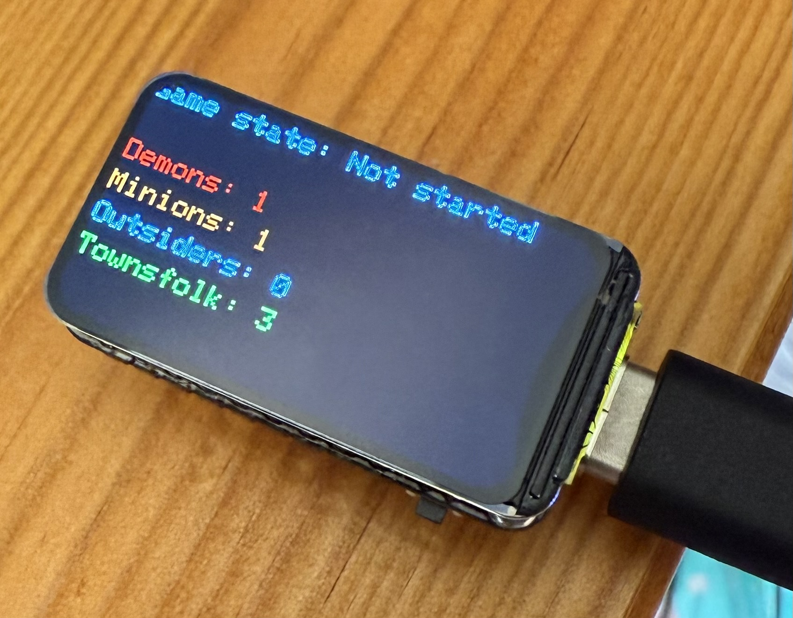

# Blood on the Clocktower Town Square Controller

An ESP32-C6 based controller for managing the town square in [Blood on the Clocktower](https://bloodontheclocktower.com/) games, featuring RGB LEDs for player status tracking and a web interface for easy game management.

## Features

- **RGB LED Player Indicators**: Supports up to 20 players with 3 LEDs per player
- **Color-coded Player States**:
  - Green: Alive players
  - Blue: Dead players with voting ability
  - Purple: Dead players without votes
  - Yellow: Travelers
  - Red/Blue: Game end indicators
- **ST7789 Color Display**: Shows game status and player counts
- **Web Interface**: Control the game from any device on your network
- **Persistent Storage**: Saves game state even after power off
- **WiFi Setup**: Easy network configuration with fallback AP mode
- **Dynamic Role Distribution**: Automatically calculates Townsfolk, Outsider, and Minion counts based on player numbers

## Hardware Requirements

- ESP32-C6 microcontroller
- ST7789 1.77" 172x320 color display
- WS2812B addressable RGB LEDs (60 LEDs for full 20-player support)
- 5V power supply with sufficient current for the LEDs
- Wiring according to the pin definitions in the code

### Pin Connections

| Component | ESP32-C6 Pin |
|-----------|--------------|
| TFT CS    | GPIO14       |
| TFT DC    | GPIO15       |
| TFT RST   | GPIO21       |
| TFT MOSI  | GPIO6        |
| TFT SCLK  | GPIO7        |
| TFT BL    | GPIO22       |
| LED Data  | GPIO8        |

## Software Setup

### Required Libraries

- Arduino core for ESP32
- WiFi
- WiFiManager
- FastLED
- ArduinoJson
- SPIFFS
- Adafruit GFX
- Adafruit ST7789
- SPI
- WebServer
- DNSServer

### Installation

1. Install Arduino IDE and ESP32 board support
2. Install all required libraries through the Arduino Library Manager
3. Select the correct board (ESP32-C6) in the Arduino IDE
4. Compile and upload the sketch to your ESP32-C6

## Getting Started

1. Power on the device
2. Connect to the "Clocktower-Setup" WiFi network that appears
3. Follow the configuration portal to connect the device to your WiFi network
4. Once connected, the display will show the device's IP address
5. Connect to the web interface using any browser and the displayed IP address

## Using the Web Interface

### Game Controls

- **Start Game**: Begins a new game with current player setup
- **Reset Game**: Resets the game to setup phase
- **Good Wins/Evil Wins**: End the game and display the winning team
- **Clear All**: Resets all saved state and restarts the device

### Player Management

For each player position:
- Enter player name in the text field and press Enter to save the name 
- Changes to player names are saved automatically when submitting the form
- Use the status button to cycle through player states:
  - "Add Player": Adds an inactive player to the game
  - "Kill": Changes a living player to dead (with vote)
  - "Remove Vote": Changes a dead player with vote to dead without vote
  - "Remove": Removes the player from the game
- Check the "Traveller" box to mark a player as a Traveller

### Game Status Display

The interface shows:
- Current game status
- Number of alive players
- Votes needed for execution
- Available votes
- Distribution of Townsfolk, Outsiders, and Minions

## Customization

You can customize the project by:
- Modifying the HTML/CSS/JavaScript in the code to change the web interface
- Adjusting the LED patterns for different player states
- Changing the role distribution calculations

## Troubleshooting

- **WiFi Connection Issues**: If the device fails to connect to WiFi, it will create its own "Clocktower-Setup" access point. Connect to it to reconfigure WiFi settings.
- **Display Not Working**: Check the connections to the ST7789 display and ensure the correct pins are defined in the code.
- **LEDs Not Lighting**: Verify the power supply can provide enough current for all LEDs and check the data connection to GPIO8.
- **Web Interface Not Accessible**: Confirm you're connected to the same network as the device and using the correct IP address.

## Contributing

Contributions to improve the project are welcome! Please feel free to submit issues or pull requests.

## License

This project is released under the MIT License. See the LICENSE file for details.

## Acknowledgments

- The [Blood on the Clocktower](https://bloodontheclocktower.com/) game by The Pandemonium Institute
- All the library authors that made this project possible
